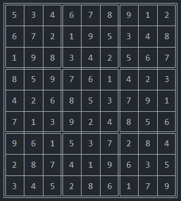
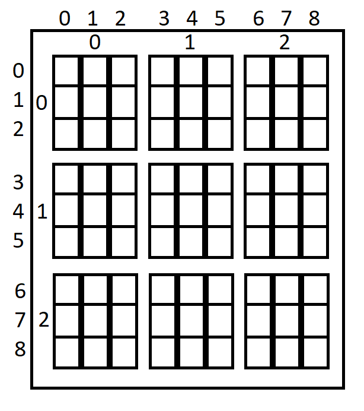
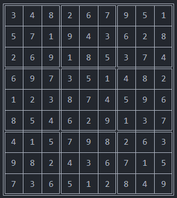

# CPP-Sudoku-Solver
C++ Sudoku Solver using BackTrack technique.

## Sudoku
### Desciption
It is a logic-based, combinatorial number-placement puzzle. In classic Sudoku, the objective is to fill a 9 × 9 grid with digits so that each column, each row, and each of the nine 3 × 3 subgrids that compose the grid (also called "boxes", "blocks", or "regions") contain all of the digits from 1 to 9. The puzzle setter provides a partially completed grid, which for a well-posed puzzle has a single solution.  
Example from [Wikipedia](https://en.wikipedia.org/wiki/Sudoku) (grid is [here](grids/wikigrid.txt)):


and solution (from **SudokuSolver**) is:



### Constraints
For each **row**, **column** and **subgrid** all 9 cells are uinque (i.e. there're no two cells with same number). Sudoku grid has 9 subgrids; **Subgrid** is 3×3 grid you can see in the image below (indexed from **(0, 0)** to **(2, 2)** inclusive inside the main grid):



## How to solve
- First, we determine the `domain` for each cell in the grid. Initially, all cells has domain from 1 to 9 inclusive but for example: if the **row** of cell has cells {1, 3, 8, 9}, its **column** has cells {1, 5, 7, 8} and its **subgrid** has {1, 2, 3, 5, 7, 8, 9} values then the cell can't have any of {1, 2, 3, 5, 7, 8, 9} which means its `domain` is {4, 6}. 
- After setting the domains, for each cell we set its `value` from its `domain` and if there's no conflict between it and its neighboring cells (cells sharing *row*, *col* or *subgrid*) move to set the remaining unassigned cells if not reset this cell and try the next value from cells' domain. Keep repeating this process untill the grid is complete. That's a ***BackTracking*** approach!

## Code Logic and Walkthrough
There're 2 main classes:
### SudokuGrid
It represents a 9×9 grid structured as `Var`iables and has utility for state validation, completeness checking and organizing input-output stuff
#### Var class
`Var` represents a ***cell*** on the grid which has current `val`ue and `domain` of values can represent.
#### Domain class
Instead of `std::vector` which has a `length` placeholder of **64**-bit size and **8**-bit for each possible value in the domain of a `Var` leading to allocate **64** bit for size + **8** bit * 9 (all possible domain values) = **136** bit for a single `Var` domain, I optimized that a little by **bit flags** (you can see [this](https://dietertack.medium.com/using-bit-flags-in-c-d39ec6e30f08) if unfamiliar to you) just for 16-bit size (8.5 better than using `std::vector`. *just for this problem of course*) with ability to `push`, `pop` or checking existence (via `has` method) of values.

### Solver
It's just application of [this](#how-to-solve) logic such having:
- `set_domains` method:
  1. Extract taken values for each row, column, subgrid.
  2. For each Var (cell); its domain will be all values that's not in its row, column or subgrid (`cell[i] = {1 : 9} - (cell[i]'s row ∪ cell[i]'s column ∪ cell[i]'s subgrid)`) 
- `backtrack` method:
```
Function backtrack():
    if grid is complete:
        return true
    cell ← select_unassigned_cell()
    for each value in cell's domain:
        cell ← value
        if there's no conflict between cell and its neighboring cells:
            result ← backtrack()
            if result is true:
                return true
        else:
            reset cell
    return false
```
## Run
After compiling files (for Ex.: `g++ SudokuGrid.cpp 
SudokuSolver.cpp main.cpp -o main`) and run exe file:
- for `grids/0.txt` (`.\main grids/0.txt`) you will be able to see:



## Material
I got grids from [dimitri/sudoku](https://github.com/dimitri/sudoku/blob/master/sudoku.txt).